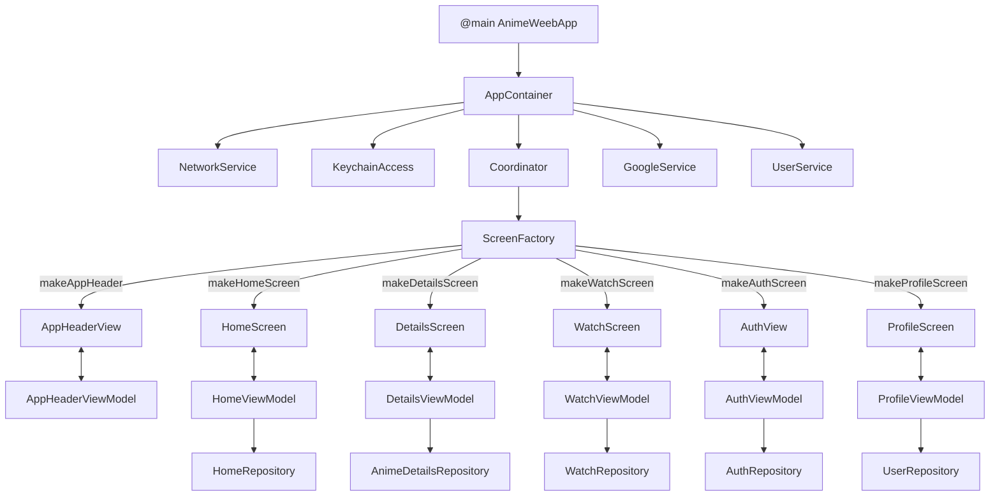

# AnimeWeeb 🌸

[🇬🇧 English](README.md) | [🇷🇺 Русский](README.ru.md)

<div align="center">
  
  
  
  
  
  
</div>

<p align="center">
  <strong>Modern client-server iOS streaming application for watching anime content</strong>
</p>

| Home | Details | Player (Watch) |
| :-: | :-: | :-: |
|  |  |  |

| Login | Confirmation (Confirm) | Profile |
| :-: | :-: | :-: |
|  |  |  |

---

## Main Features

### 1. 1. Authentication Module (Auth)
- **Google Sign-In:** Integration with Google Sign-In (`GoogleService`) for quick authentication.
- **Code-based Login/Confirmation:** Login (`LoginScreen`) and code confirmation (`LoginConfirmScreen`) screens with interactive inputs and verification-code requests.
- **Secure Storage:** Session tokens and user data are securely stored using `KeychainAccess`.

### 2. 2. Home
- **Anime Catalog:** Displays popular and newly released anime using custom cards.
- **Loading Skeletons:** Smooth loading animations (`SkeletonHomeContentView`) using the `SwiftUI-Shimmer` library.

### 3. 3. Anime Details
- **Title Information:** Detailed description, genres (using `TagCloud`), rating, and status information.
- **Seasons and Episodes:** Expandable season lists (`SeasonExpanableView`) and episode rows (`EpisodeRowView`).
- **Watch Status:** Interactive component (`WatchStatusPicker`) for adding anime to personal lists ("Watching", "Plan to Watch", "Watched").

### 4. 4. Player and Watch
- **Custom Player:** `AWVideoPlayer` wrapper around the system `AVPlayer` with full playback control.
- **Quality Control:** Switching between available video resolutions (`QualityPicker` / `QualityType`).
- **Breadcrumbs:** Navigation elements (`BreadcrumbsView`) for quickly returning to anime details or the episode list.
- **Timecodes:** Convenient episode timecode handling through custom extensions (`Int+Timecode`).

### 5. 5. Profile and User Lists
- **Profile Card:** Displays the avatar, username, and basic information (`ProfileCard`).
- **Profile Editing:** Editing user information and sending multipart requests to the backend (`ProfileEditCard`).
- **Watch History:** List of recently watched episodes with progress cards (`WatchHistoryView`).
- **Personal Lists:** Filtering and viewing titles by user-defined categories (`UserAnimeListsView`).

### 6. 6. Core & Network
- **Network Client:** Universal `NetworkService` supporting endpoints (`Endpoint`), different HTTP methods, error handling (`NetworkError`), and multipart data (`MultipartItem`).
- **Validation and Utilities:** A set of extensions for strings (`String+Validation`, `String+Char`), keyboard handling (`DismissKeyboardOnTapModifier`, `TextFieldFocusModifier`), and device parameter detection.

---

## Architecture



## Tech Stack

* **Language:** Swift 5
* **UI Framework:** SwiftUI
* **Architecture:** MVVM-C
* **Code Quality:** SwiftLint (`.swiftlint.yml`)
* **Security:** AppCheck (защита сервисов Google)

### Dependencies (Swift Package Manager)

* [GoogleSignIn-iOS](https://github.com/google/GoogleSignIn-iOS) & **AppAuth** — authentication.
* [Nuke](https://github.com/kean/Nuke) — image loading, caching, and display.
* [KeychainAccess](https://github.com/kishikawakatsumi/KeychainAccess) — secure storage of sensitive data.
* [SwiftUI-Shimmer](https://github.com/markiv/SwiftUI-Shimmer) — loading animations (Skeleton views).
* [TagCloud](https://github.com/yarspirin/TagCloud) — tag cloud for displaying genres.

---

## Quick Start

### Requirements

* Xcode 15.0+
* iOS 15.0+
* Swift 5

### Installation

1. Clone the repository:

```bash
git clone [https://github.com/MaksimSazanovich/AnimeWeeb-iOS.git](https://github.com/MaksimSazanovich/AnimeWeeb-iOS.git)
cd AnimeWeeb-iOS

```

2. Open the project in Xcode (double-click `Package.swift` or `AnimeWeeb.xcodeproj`).
3. Wait for the SPM dependencies to finish loading.
4. Press `⌘R` to build and run the app on a simulator or a real device.

> **Important:** Make sure the required configuration files (for example, `GoogleService-Info.plist` or an `.xcconfig` file containing secrets) are added to the project for authentication and networking to work correctly.

---

## License

The project is distributed under the [PolyForm Noncommercial License 1.0.0](LICENSE).

The code may be studied, run, modified, and used for non-commercial purposes. Commercial use, commercial derivative projects, and inclusion of the code in commercial products require separate written permission from the copyright holder.

---

<div align="center">
  <p>⭐ If you find the project useful, consider giving it a star!</p>
</div>
