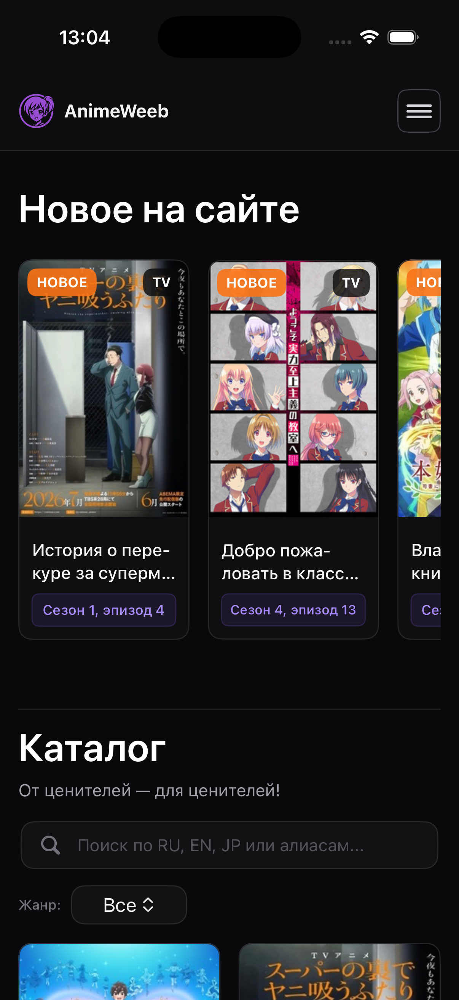
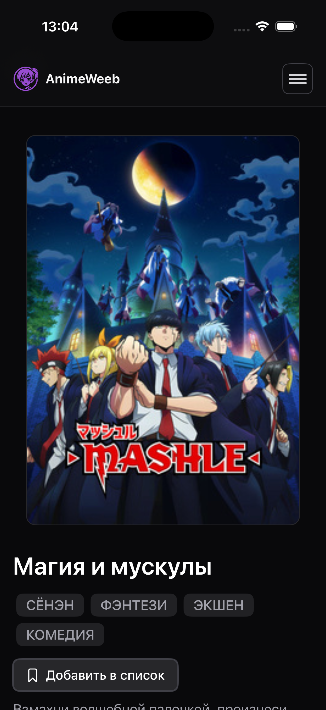
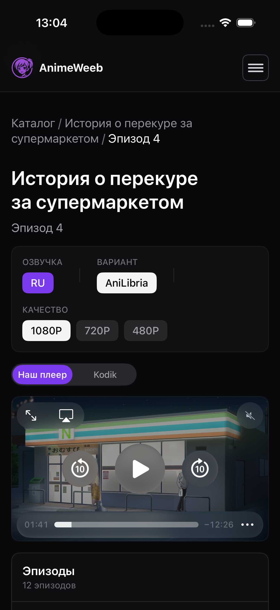
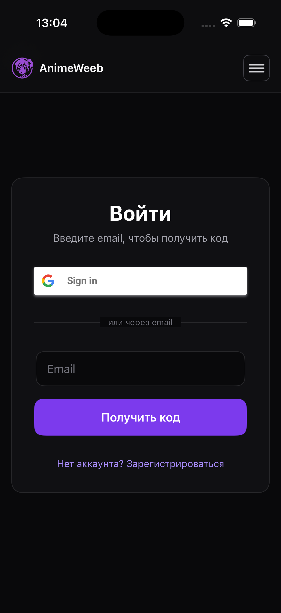
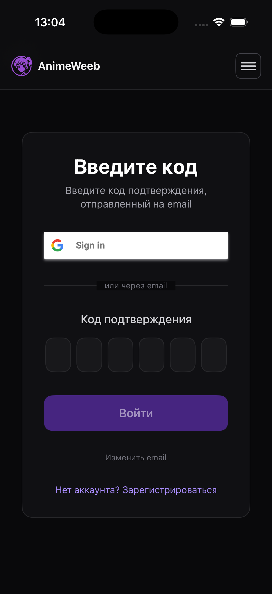
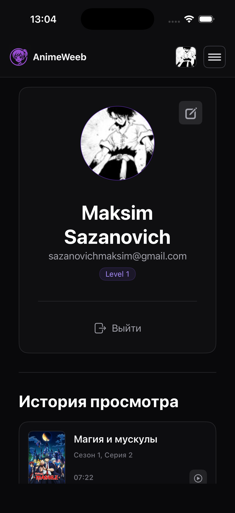
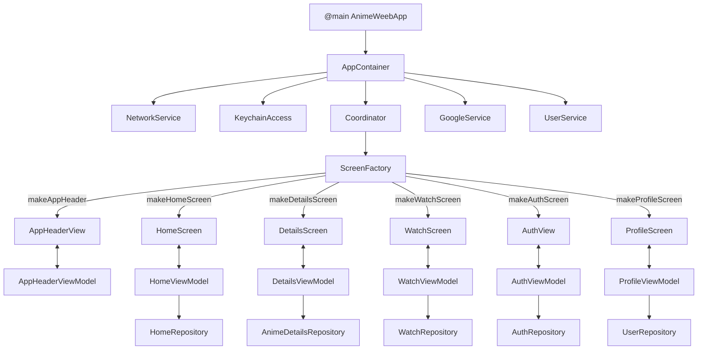

# AnimeWeeb 🌸

<div align="center">
  
  
  
  
  
  
</div>

<p align="center">
  <strong>Современное cтриминговое клиент-серверное iOS-приложение для просмотра медиаконтента (аниме)</strong>
</p>

| Главная (Home) | Детали (Details) | Плеер (Watch) |
| :-: | :-: | :-: |
|  |  |  |

| Вход (Login) | Подтверждение (Confirm) | Профиль (Profile) |
| :-: | :-: | :-: |
|  |  |  |

---

## Основные возможности и модули

Проект разбит на независимые фича-модули для обеспечения масштабируемости и удобства поддержки:

### 1. Модуль авторизации (Auth)
- **Вход через Google:** Интеграция с сервисом Google Sign-In (`GoogleService`) для быстрой аутентификации.
- **Вход/Подтверждение по коду:** Экран логина (`LoginScreen`) и подтверждения кода (`LoginConfirmScreen`) с интерактивными инпутами и запросом проверочных кодов.
- **Безопасное хранение:** Сохранение токенов сессии и пользовательских данных с использованием `KeychainAccess`.

### 2. Главный экран (Home)
- **Каталог аниме:** Отображение популярных и свежих релизов в виде кастомных карточек.
- **Скелетоны загрузки:** Плавная анимация загрузки данных (`SkeletonHomeContentView`) с использованием библиотеки `SwiftUI-Shimmer`.

### 3. Детальная страница аниме (Anime Details)
- **Информация о тайтле:** Подробное описание, жанры (через `TagCloud`), рейтинг и статусы.
- **Сезоны и серии:** Раскрывающиеся списки сезонов (`SeasonExpanableView`) и ряды серий (`EpisodeRowView`).
- **Статус просмотра:** Интерактивный компонент (`WatchStatusPicker`) для добавления аниме в персональные списки («Смотрю», «В планах», «Просмотрено»).

### 4. Плеер и просмотр (Watch)
- **Кастомный плеер:** Обёртка `AWVideoPlayer` над системным `AVPlayer` с полным контролем воспроизведения.
- **Управление качеством:** Переключение доступных разрешений видео (`QualityPicker` / `QualityType`).
- **Хлебные крошки:** Навигационные элементы (`BreadcrumbsView`) для быстрого возврата к деталям аниме или списку серий.
- **Таймкоды:** Удобная работа с таймкодами серий через кастомные расширения (`Int+Timecode`).

### 5. Профиль и пользовательские списки (Profile)
- **Карточка профиля:** Отображение аватара, никнейма и базовой информации (`ProfileCard`).
- **Редактирование профиля:** Изменение личных данных пользователя с отправкой мультипарт-запросов на бэкенд (`ProfileEditCard`).
- **История просмотров:** Список недавно просмотренных серий с карточками прогресса (`WatchHistoryView`).
- **Персональные списки:** Фильтрация и просмотр тайтлов по пользовательским категориям (`UserAnimeListsView`).

### 6. Ядро и сетевой слой (Core & Network)
- **Сетевой клиент:** Универсальный `NetworkService` с поддержкой эндпоинтов (`Endpoint`), различных HTTP-методов, обработки ошибок (`NetworkError`) и отправки составных данных (`MultipartItem`).
- **Валидация и утилиты:** Набор расширений для строк (`String+Validation`, `String+Char`), работы с клавиатурой (`DismissKeyboardOnTapModifier`, `TextFieldFocusModifier`) и определения параметров устройства.

---

## Архитектура



## Технологический стек

* **Язык:** Swift 5.x / 6
* **UI-фреймворк:** SwiftUI
* **Архитектура:** MVVM-C
* **Качество кода:** SwiftLint (`.swiftlint.yml`)
* **Безопасность:** AppCheck (защита сервисов Google)

### Зависимости (Swift Package Manager)

* [GoogleSignIn-iOS](https://github.com/google/GoogleSignIn-iOS) & **AppAuth** — авторизация.
* [Nuke](https://github.com/kean/Nuke) — загрузка, кэширование и отображение изображений.
* [KeychainAccess](https://github.com/kishikawakatsumi/KeychainAccess) — безопасное хранение чувствительных данных.
* [SwiftUI-Shimmer](https://github.com/markiv/SwiftUI-Shimmer) — анимация загрузки (Skeleton views).
* [TagCloud](https://github.com/yarspirin/TagCloud) — облако тегов для отображения жанров.

---

## Быстрый старт

### Требования

* Xcode 15.0+
* iOS 15.0+
* Swift 5.x+

### Установка

1. Склонируйте репозиторий:

```bash
git clone [https://github.com/MaksimSazanovich/AnimeWeeb-iOS.git](https://github.com/MaksimSazanovich/AnimeWeeb-iOS.git)
cd AnimeWeeb-iOS

```

2. Откройте проект в Xcode (двойной клик по `Package.swift` или `AnimeWeeb.xcodeproj`).
3. Дождитесь загрузки SPM-зависимостей.
4. Нажмите `⌘R` для сборки и запуска на симуляторе или реальном устройстве.

> **Важно:** Убедитесь, что конфигурационные файлы (например, `GoogleService-Info.plist` или `.xcconfig` с секретами) добавлены в проект для корректной работы авторизации и сети.

---

## Лицензия

Проект распространяется по [PolyForm Noncommercial License 1.0.0](LICENSE).

Код можно изучать, запускать, изменять и использовать для некоммерческих целей. Коммерческое использование, коммерческие производные проекты и включение кода в коммерческие продукты требуют отдельного письменного разрешения правообладателя.

---

<div align="center">
  <p>⭐ Если проект оказался полезным — поставьте звезду!</p>
</div>
